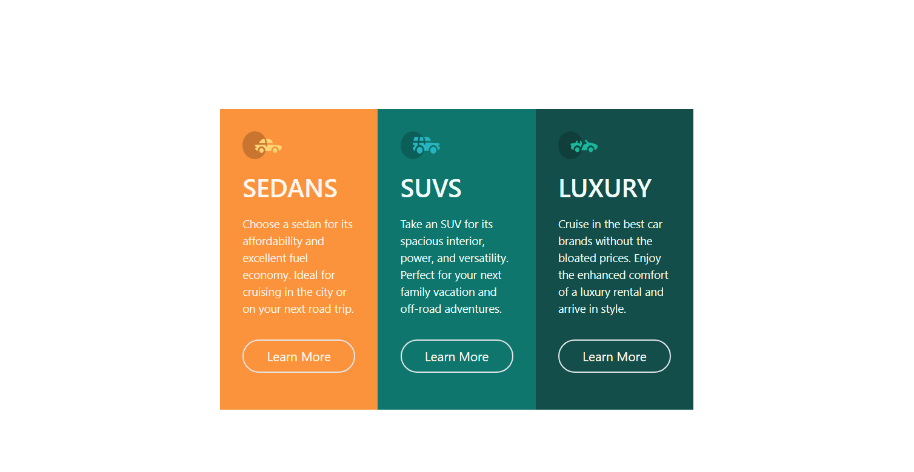
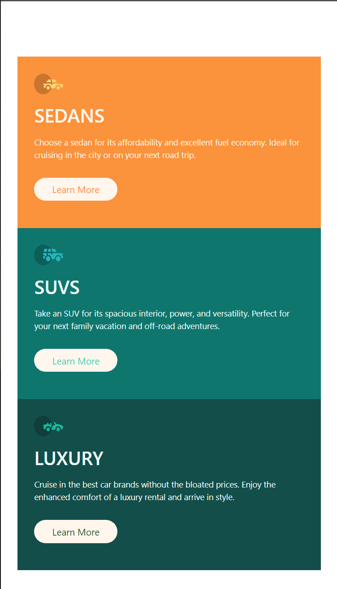

# Frontend Mentor - Sunnyside agency landing page

## Welcome! 👋

Thanks for checking out this front-end coding challenge.

## The challenge

Your challenge is to build out this 3-column preview card component and get it looking as close to the design as possible.Users should be able to:
- View the optimal layout depending on their device's screen size
- See hover states for interactive elements

## Building your project

## Deploying your project
- [Vercel](https://vercel.com/)

**Have fun watching!** 🚀
